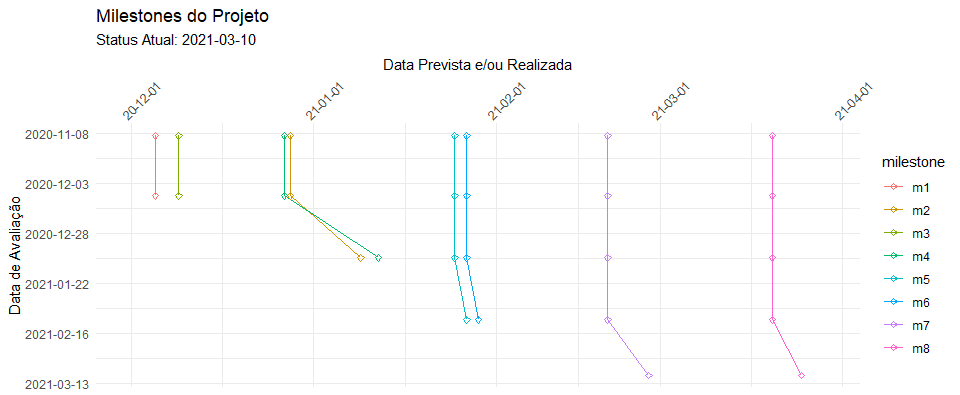

# Stream Diagram

O Stream Diagram ou Diagrama de Cordas é um diagrama de controle de projetos.    
     
A ideia é ter uma linha do tempo de datas de compromissos: milestones, eventos ou entregas. E repetir esta linha do tempo periodicamente.    

A "corda" é construída através da visualização da manutenção ou deslize da data planejada para determinado compromisso (entrega) durante a evolução do projeto.    
   
    
     
O Diagrama de Cordas é uma variação do Diagrama de Dispersão (Scatter Diagram).     
      
Um exemplo de como construir um Diagrama de Cordas com Excel pode ser encontrado no arquivo Excel anexo ao projeto.      
      
Se projetarmos uma tendência através da inclinação das curvas geradas por eventuais desvios nas datas de compromisso, teremos com o ângulo de inclinação algo equivalente aos índices de performance da Análise de Valor Agregado (IDP - Índice de Performance de Prazo ou IDC - Índice de Performance de Custo).    

Por fim, o Diagrama de Cordas possui um fator psicológico importante. É comum em projetos quando ocorrem os atrasos com as primeiras entregas um desejo de "compensar o atraso", e manter os compromissos das entregas futuras. Mas, quando é feito um esforço de compensação, e os atrasos se mantém para as entregas seguintes, a frustração gerada acaba por tirar da conversa a possibilidade de reavaliar os compromissos futuros. O Diagrama de Cordas, ajuda a manter a visão do todo e antecipar discussões importantes sobre reavaliação de compromissos de prazo e escopo, e até mesmo de objetivos.    

